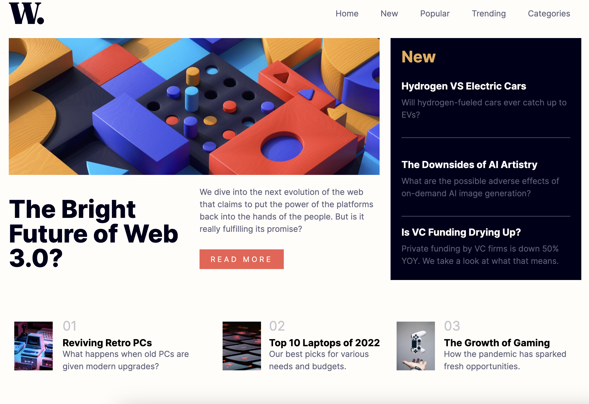

# Frontend Mentor - News homepage solution

This is a solution to the [News homepage challenge on Frontend Mentor](https://www.frontendmentor.io/challenges/news-homepage-H6SWTa1MFl). Frontend Mentor challenges help you improve your coding skills by building realistic projects. 

## Table of contents

- [Overview](#overview)
  - [The challenge](#the-challenge)
  - [Screenshot](#screenshot)
  - [Links](#links)
- [My process](#my-process)
  - [Built with](#built-with)
  - [What I learned](#what-i-learned)
  - [Continued development](#continued-development)
  - [Useful resources](#useful-resources)
- [Author](#author)
- [Acknowledgments](#acknowledgments)

## Overview

### The challenge

Users should be able to:

- View the optimal layout for the interface depending on their device's screen size
- See hover and focus states for all interactive elements on the page

### Screenshot

### Links

- [Solution URL](https://github.com/Kure-ru/News_homepage)
-  [Live Site URL](https://kure-ru.github.io/News_homepage/)

## My process

### Built with

- Semantic HTML5 markup
- CSS custom properties
- Flexbox
- CSS Grid
- Mobile-first workflow

### What I learned

I learned how to create a toggle menu with Javascript.

### Continued development

/

### Useful resources
- [How to Create a Slideshow with HTML, CSS, and JavaScript](https://www.freecodecamp.org/news/how-to-create-a-slideshow/)

## Author

- Website - [Claire Inada](https://claireinada.netlify.app/)
- Frontend Mentor - [@Kure-ru](https://www.frontendmentor.io/profile/Kure-ru)
- Twitter - [@claire_inada](https://twitter.com/claire_inada)

## Acknowledgments

